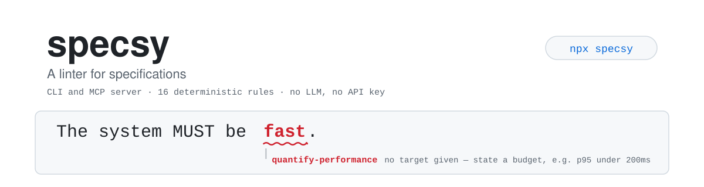
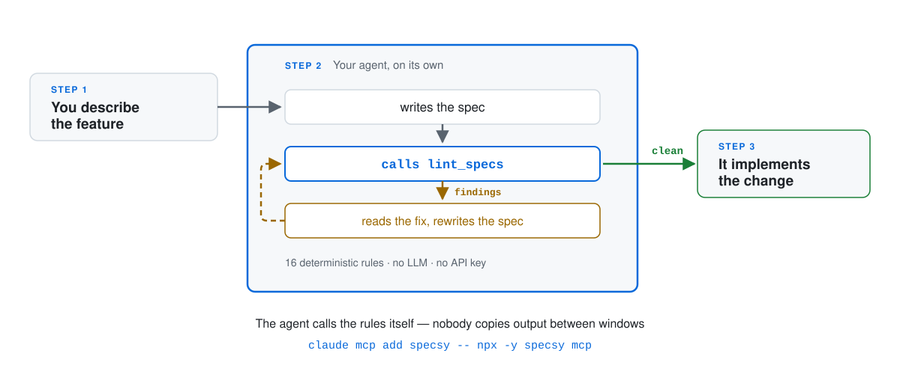

<p align="center">
  <picture>
    <source media="(prefers-color-scheme: dark)" srcset="assets/banner-dark.svg">
    
  </picture>
</p>

<p align="center">
  <a href="https://www.npmjs.com/package/specsy"></a>
  <a href="https://github.com/Zaidnaz/specsy/actions/workflows/ci.yml"></a>
  <a href="LICENSE"></a>
  
</p>

**A linter for specifications.** It catches vague, untestable and untraceable requirements *before* an AI agent turns them into code.

```
openspec/changes/add-auth/specs/auth/spec.md
  16:24  warn   "reasonable" is not measurable.            no-weasel-words
                → Replace with the observable outcome. What would you check
                  to know "reasonable" was achieved?
  16:67  error  Performance claim "fast" has no target.    quantify-performance
                → State a budget and a percentile, e.g. "p95 under 200ms".

openspec/changes/add-auth/tasks.md
  6:1    error  Task references "AUTH-9", which is not defined in this change.
                → Either the id is a typo or the requirement was never written down.

✖ 10 problems (4 errors, 6 warnings) in 3 documents.
```

## Why this exists

Spec-driven development tools — [OpenSpec](https://github.com/Fission-AI/OpenSpec), [GitHub Spec Kit](https://github.com/github/spec-kit), Kiro, BMAD — all give you a **template**. None of them check whether what you wrote into it is any good.

So teams fill a beautifully structured `spec.md` with "should be fast", "handle errors gracefully", "user-friendly" — and the agent, which cannot ask a follow-up question at 2am, invents an answer. The spec was never the bottleneck. The *quality* of the spec was.

specsy is the compiler pass that was missing. It reads the specs you already have, in the format you already use, and refuses to let an unanswerable requirement reach an agent.

**It is not another spec format.** It sits on top of the one you have.

## How it works

<p align="center">
  <picture>
    <source media="(prefers-color-scheme: dark)" srcset="assets/workflow-dark.svg">
    
  </picture>
</p>

specsy sits between the spec you wrote and the agent that implements it. Findings come back with a `file:line` and a concrete fix, and the command exits `1` — so a spec that cannot be built correctly never reaches the agent in the first place.

## Install

specsy lints the directory you run it **from**, so run it inside a project:

```bash
cd my-project
npx specsy
```

Or add it as a dev dependency:

```bash
npm install -D specsy     # or: pnpm add -D specsy
npx specsy
```

> A local install is not on your `PATH` — typing a bare `specsy` will fail with *"not recognized as an internal or external command"*. Use `npx specsy`, or add `"lint:spec": "specsy"` to your `package.json` scripts, where `node_modules/.bin` is already on the path. Install globally (`npm i -g specsy`) only if you want the bare command everywhere.

## Usage

```bash
specsy                      # auto-detect the format, lint everything
specsy openspec/            # point at a directory
specsy --format openspec    # force an adapter
specsy --reporter json      # machine-readable output
specsy --reporter github    # inline annotations on a PR diff
specsy --quiet              # errors only
specsy --max-warnings 0     # treat warnings as failures too
specsy rules                # list every rule
```

Exit codes: `0` clean, `1` findings, `2` the linter itself could not run.

## Supported formats

| Adapter | Reads |
|---|---|
| `openspec` | `openspec/changes/<id>/{proposal,design,tasks}.md` plus delta specs and the living `specs/` tree |
| `generic` | any directory of markdown — **opt-in**, via `--format generic`. Never auto-detected: "a folder containing markdown" describes a home directory as readily as a spec folder |

Spec Kit and Kiro adapters are the next ones planned. An adapter only has to describe a directory layout; all parsing and every rule is shared. See [`src/adapters/`](src/adapters/).

## Rules

16 rules, all deterministic — no model calls, no API key, no network. Run them on every commit for free.

| Rule | Default | Applies to | What it catches |
|---|---|---|---|
| `no-weasel-words` | warn | `spec`, `proposal` | Subjective words that cannot be turned into a test. |
| `quantify-performance` | error | `spec`, `proposal` | Performance claims with no number and unit. |
| `use-normative-keywords` | warn | `spec` | Soft modals ("will", "needs to") instead of MUST / SHOULD / MAY. |
| `one-requirement-per-statement` | warn | `spec` | Sentences bundling several obligations into one. Line wrapping does not affect it. |
| `no-ambiguous-pronoun` | warn | `spec` | Requirements opening with a pronoun that has no antecedent. |
| `require-acceptance-criteria` | error | `spec` | Requirements with no scenario to verify them. |
| `no-placeholders` | error | all | TODO/TBD markers and unfilled template slots. |
| `no-empty-sections` | warn | all | Headings with nothing beneath them. |
| `require-sections` | warn | `proposal`, `design` | Documents missing the sections their kind expects. |
| `no-implementation-in-requirements` | warn | `spec` | Requirements naming a library instead of a behaviour. |
| `unique-requirement-ids` | error | all | Two requirements sharing an id, anywhere in the change. |
| `tasks-reference-requirements` | warn | `tasks` | Tasks not linked to any requirement. †|
| `no-dangling-references` | error | `tasks` | Tasks citing a requirement id that does not exist. |
| `requirements-have-tasks` | warn | `spec` | Requirements no task implements. †|
| `require-non-goals` | warn | `proposal` | Proposals that never say what they are *not* doing. |
| `require-requirement-ids` | warn | `spec` | Requirements with no stable id to cite. †|

† **These three rules switch themselves on.** Requirement ids and task citations are disciplines a team opts into — no spec format mandates them, and OpenSpec's `tasks.md` never cites requirements. Demanding them unconditionally would flag every line of a perfectly good spec, so each rule stays silent until the change already uses the convention somewhere. Adopt ids on one requirement and the rest of the spec is held to it.

Code fences are never linted, so example snippets inside a spec stay untouched.

**Requirement id format.** An id is `PREFIX-N` — two to five uppercase alphanumerics, a hyphen, then digits: `REQ-001`, `ACCT-14`, `TXN-7`. It must open the requirement's heading (`### Requirement: ACCT-001 Account creation`), and ids must be unique across the whole change, not merely within one file — a task citing `ACCT-001` cannot tell two `spec.md` files apart. Ids are optional; see the † note above.

Standards references are not requirement ids. `ISO-4217`, `ISO-8601`, `RFC-3339` and `SHA-256` match the shape of an id but are excluded, and a requirement takes its id only from the start of its heading (`### Requirement: REQ-014 Account creation`) — a mention in prose never christens one.

**Proposals are linted as prose.** A proposal rarely contains formal `MUST` requirements, so the clarity rules read every line of it — except the motivation sections (`Why`, `Background`, `Context`, `Problem`, `Rationale`). "Search feels slow" there is a problem statement, not an unmeasurable requirement, and is left alone.

## Configuration

Drop a `.specsyrc.json` anywhere at or above the directory you lint:

```json
{
  "format": "auto",
  "rules": {
    "require-requirement-ids": "error",
    "no-implementation-in-requirements": "off"
  },
  "weaselWords": ["performant-ish", "TBC"]
}
```

Every rule takes `"error"`, `"warn"` or `"off"`. `weaselWords` is merged with the built-in list, not replaced.

## In CI

```yaml
- run: npx specsy --reporter github --max-warnings 0
```

The `github` reporter emits workflow annotations, so findings land inline on the pull request diff.

As a pre-commit hook:

```bash
npx specsy --quiet || exit 1
```

## Programmatic use

```ts
import { detectAdapter, lint, formatJson } from "specsy";

const adapter = await detectAdapter("./openspec");
const project = await adapter.load("./openspec");
const result = lint(project, { rules: { "no-weasel-words": "off" } });

console.log(result.errorCount, result.diagnostics);
```

The CLI is a thin wrapper over exactly these exports.

## Roadmap

v0.1 is the lint layer. The two things that follow are where this gets genuinely hard, and genuinely valuable:

- **`spec trace`** — build the requirement → task → file → test graph and report what is uncovered on either side.
- **`spec drift`** — diff the code against the last archived spec and flag requirements whose implementation changed without a spec delta. Specs rot the moment a hotfix lands, and nothing today detects it.

Adapters for Spec Kit and Kiro, and a rule-authoring guide, are also planned.

## Contributing

A new rule is one file in [`src/rules/`](src/rules/) and one entry in the registry. Rules see a neutral model ([`src/model.ts`](src/model.ts)), never raw markdown, so a rule written once works across every format.

```bash
pnpm install
pnpm build
pnpm test
```

Please add a fixture case in [`tests/fixtures/`](tests/fixtures/) for anything a new rule should — and should not — flag. False positives are worse than missed findings here: a linter people mute is a linter that does nothing.

## License

MIT
